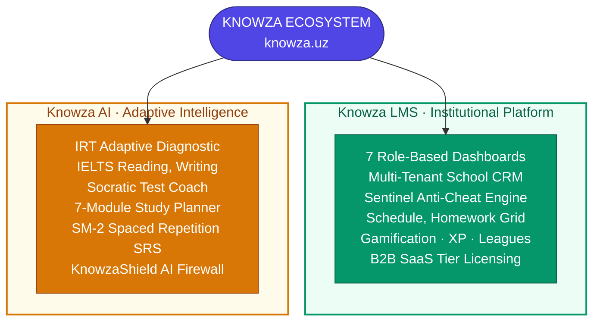
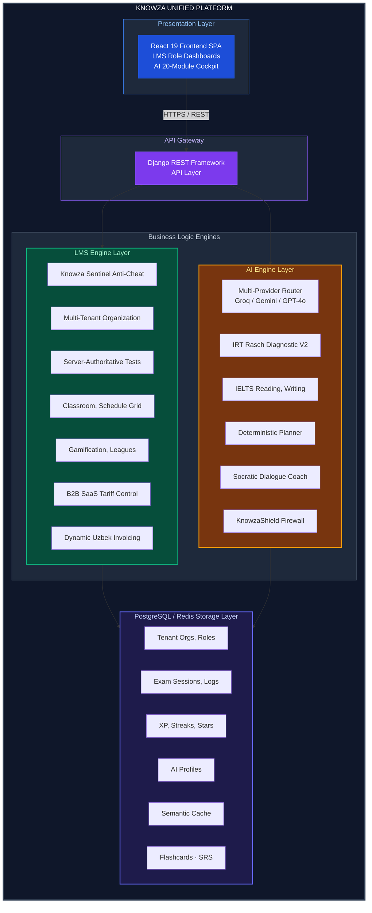

# 🎓 Knowza — The Complete Educational Operating System & AI Intelligence Ecosystem (v3.0.0)

> **Knowza** is an enterprise-grade, full-spectrum EdTech ecosystem that seamlessly unifies **Knowza LMS** (Institutional School Management & Server-Authoritative Assessment Platform) and **Knowza AI** (Adaptive AI Tutoring, IRT Diagnostics & Multi-Model Exam Engine) into a single, high-performance architecture.

[](https://knowza.uz)
[](./updates/update_v3.0.0.md)
[-emerald?style=for-the-badge)](./docs/LMS_FEATURES.md)
[-orange?style=for-the-badge)](./docs/AI_FEATURES.md)
[](./backend)
[](./frontend)

---

## 🌐 The Knowza Vision: Two Flagship Pillars, One Unified Company

Modern educational institutions and students face a fragmented learning experience: schools juggle disparate spreadsheets and insecure quiz tools, while students lack personalized 24/7 intelligent guidance. 

**Knowza** solves this by uniting the institutional management layer and the personalized adaptive AI intelligence layer into **one seamless ecosystem**:



---

## ⚖️ Core Platform Comparison & Synergies

| Capability Area | 🏫 Knowza LMS (Institutional Operating System) | 🤖 Knowza AI (Personalized Intelligence Suite) |
|---|---|---|
| **Target Audience** | Schools, Learning Centers, Teachers, Administrators | Individual Students, Self-Learners, Exam Candidates |
| **Primary Focus** | Secure testing, school CRM, group scheduling, academic tracking | Adaptive diagnostics, Socratic tutoring, skill gap remediation |
| **User Interfaces** | 7 Dedicated Dashboards (Head Admin, Admin, Branch, Teacher, etc.) | 20-Page Spatial Student Learning Suite & Interactive Studios |
| **Exam Standards** | Institutional Exams, School Quizzes, Homework Assignments | IELTS (Academic/General), Digital SAT, Milliy Sertifikat, CEFR (A0–B2) |
| **Security & Integrity** | **Knowza Sentinel Anti-Cheat** (Server-authoritative timers, tab tracking) | **KnowzaShield Firewall** (Anti-injection, jailbreak defense) |
| **Motivation Loop** | Gamified Weekly Leagues, Daily Streaks, Stars Currency | Interactive Mastery Badges, Milestone Progress, Socratic Guidance |
| **Monetization** | B2B Multi-Tier SaaS Subscriptions (Per-student & per-branch) | B2C Pro Subscriptions, AI Token Packs, Micro-Transactions |

---

## 🏛️ Unified System Architecture

Knowza is built on a shared, robust backend powering both the institutional LMS operations and high-throughput AI streams:



---

## 🏫 Pillar 1: Knowza LMS Deep Dive

Knowza LMS serves as the full operational backbone for educational organizations:

### 1. 👥 Multi-Role Workspace System
- **Head Admin**: System-wide superuser console for platform health, tenant monitoring, and universal governance.
- **Admin**: Full school/center management cockpit (user onboarding, billing, academic analytics, and reports).
- **Branch Admin**: Scoped administrative delegation isolated to individual school branches.
- **Teacher**: Intuitive test builder, homework publisher with file attachments, and student progress tracking.
- **Student**: Daily class schedule, test-taking room, homework hub, and gamified progress profile.
- **Seller & Content Manager**: Sales commission tracking and central curriculum asset management.

### 2. 🛡️ Knowza Sentinel Anti-Cheat Engine
- **Server-Authoritative Test Sessions**: Exam timers tick strictly on the backend, preventing client-side clock tampering.
- **Active Focus & Violation Tracking**: Logs tab switches, browser window blurs, and visibility changes in real time.
- **Configurable Auto-Ban**: Threshold-based automatic session termination with instant 0-score assignment for unauthorized actions.

### 3. 🎮 Gamification & Retention Economy
- **Leagues & Divisions**: Weekly competitive divisions (Bronze to Diamond) inspired by top retention models.
- **Stars & Streaks**: Platform currency earned through honest exam completion, spendable on customizations, profile cosmetics, and extra test attempts.
- **XP Progression**: Continuous experience point accumulation driving daily student engagement.

---

## 🤖 Pillar 2: Knowza AI Deep Dive

Knowza AI provides personalized, adaptive tutoring and cognitive mastery:

### 1. 🧪 IRT Adaptive Diagnostic Engine (V2)
- Evaluates student ability ($\theta$) across reading, grammar, and vocabulary using the **Item Response Theory (Rasch Model)**.
- Calibrates difficulty in real time to locate precise student proficiency boundaries within 15–20 questions.

### 2. 📖 Adaptive IELTS Suite (Reading & Writing)
- **IELTS Reading Engine**: Multi-paragraph academic passages with 4 dynamic question types (True/False/Not Given, Headings, Summary Completion, Multiple Choice).
- **IELTS Writing Evaluator**: Task 1 & Task 2 grading across official Cambridge criteria (Task Achievement, Coherence & Cohesion, Lexical Resource, Grammatical Range & Accuracy) with sentence-by-sentence actionable improvements.

### 3. 🗺️ Deterministic 7-Module Study Planner
- High-speed Python engine generating zero-token Free roadmaps and token-compressed Pro plans (>80% LLM cost reduction).
- Generates 4-phase milestone roadmaps tailored to student exam goals and diagnostic gap profiles.

### 4. 🎓 Socratic Test Coach & SM-2 SRS Decks
- **Socratic Tutoring**: Real-time contextual guidance during practice questions without revealing direct spoilers.
- **Spaced Repetition (SRS)**: Implements the **SuperMemo SM-2 algorithm** for daily AI-generated vocabulary and grammar memory decks.

### 5. 🛡️ KnowzaShield AI Firewall & Multi-Provider Gateway
- **Multi-Provider Failover Router**: Auto-failover across **Groq (`llama-3.3-70b`)**, **Google Gemini 2.0/1.5**, and **OpenAI GPT-4o** with sub-500ms response times.
- **KnowzaShield**: Multilingual prompt-injection, jailbreak, and role-hijacking protection layer.

---

## 📁 Repository Structure

```
Knowza-Overview/
│
├── Knowza AI/                             # Core AI Engine & Specialized Frontend Suite
│   ├── backend/                           # Django REST Framework Backend
│   │   ├── ai_engine/
│   │   │   ├── ai_study_planner.py        # Legacy & bridge study planner adapter
│   │   │   ├── cognitive_pedagogy.py      # Cognitive spaced repetition scheduler
│   │   │   ├── diagnostic_engine.py       # IRT-based adaptive diagnostic test
│   │   │   ├── firewall.py                # KnowzaShield anti-injection security layer
│   │   │   ├── ielts_reading_engine.py    # IELTS Adaptive Reading passage & evaluation engine
│   │   │   ├── ielts_writing_engine.py    # IELTS Writing Task 1 & 2 criteria grading engine
│   │   │   ├── knowledge.py               # RAG knowledge base interface
│   │   │   ├── knowza_bridge.py           # Central AI orchestration layer
│   │   │   ├── memory_engine.py           # Long-term knowledge gap tracking
│   │   │   ├── mock_engine.py             # Timed mock exam simulation engine
│   │   │   ├── queue_engine.py            # Daily missions & queue scheduler
│   │   │   ├── roadmap_engine.py          # Study roadmap generation coordinator
│   │   │   ├── srs_engine.py              # SM-2 Spaced Repetition System
│   │   │   ├── streak_engine.py           # Habit & streak tracking engine
│   │   │   ├── streamer.py                # Server-Sent Events (SSE) streaming engine
│   │   │   ├── test_coach.py              # Real-time Socratic AI tutoring during tests
│   │   │   ├── test_engine.py             # Assessment test runner & validator
│   │   │   ├── utils.py                   # Multi-provider router with auto-failover
│   │   │   ├── vdb.py                     # Vector database semantic cache interface
│   │   │   ├── brain/                     # Modular brain sub-components (gateway, cache, profiling)
│   │   │   ├── exam_bank/                 # Validated question repositories (IELTS, SAT, MS)
│   │   │   ├── prompts/                   # Specialized system prompts for each pedagogical intent
│   │   │   └── study_plan/                # 7-module deterministic study plan engine
│   │   └── api/
│   │       ├── ai_knowza_views.py         # Primary Knowza AI ViewSet endpoints
│   │       └── ielts_views.py             # IELTS Adaptive Reading & Writing ViewSet
│   │
│   └── frontend/                          # React 19 + Vite Frontend
│       └── src/
│           ├── components/                # Specialized Knowza UI widgets & loaders
│           ├── context/                   # Global state providers
│           └── pages/                     # Complete 20-Page Knowza AI Frontend Suite
│
├── docs/                                  # In-Depth Technical & Architecture Documentation
│   ├── ARCHITECTURE.md                    # Master Ecosystem Architecture overview
│   ├── LMS_ARCHITECTURE.md                # Knowza LMS Multi-Tenant & Anti-Cheat Blueprint
│   ├── AI_ARCHITECTURE.md                 # Knowza AI Multi-Model LLM Gateway & Pipelines
│   ├── FEATURES.md                        # Combined Feature Ecosystem Inventory
│   ├── LMS_FEATURES.md                    # Detailed Knowza LMS Feature Inventory
│   ├── AI_FEATURES.md                     # Detailed Knowza AI Feature Inventory
│   └── API_REFERENCE.md                   # Unified Platform API Specification
│
├── presentation/                          # Business, Pitch & Demonstration Package
│   ├── PITCH_DECK.md                      # Strategic Startup Pitch Deck & Market Analysis
│   └── DEMO_FLOW.md                       # Comprehensive Live Demonstration Script
│
├── researches/                            # Academic & Scientific Research Papers
│   └── KNOWZA_AI_RESEARCH_PAPER.md        # Pedagogical & IRT Research Documentation
│
├── updates/                               # 7+ Month Complete Development Changelog (v1.0.0 → v3.0.0)
│   ├── README.md                          # Release Timeline Index & Milestones Summary
│   ├── AI_CHANGELOG.md                    # Dedicated AI Milestones Timeline
│   └── update_v*.md                       # Individual Version Changelogs
│
└── README.md                              # Master Repository Overview
```

---

## 📊 Comprehensive Platform Metrics (v3.0.0)

| Category | Metric | Value |
|---|---|---|
| **Ecosystem** | **Development Span** | 7+ Months (Nov 2025 – Present) |
| | **Major Product Releases** | 16 Version Milestones |
| | **Supported Languages** | Uzbek 🇺🇿, Russian 🇷🇺, English 🇬🇧 |
| **Knowza LMS** | **Supported Roles** | 7 (Head Admin, Admin, Branch Admin, Teacher, Student, Seller, Content Manager) |
| | **Anti-Cheat Engine** | Knowza Sentinel (Tab switch, window blur, server-authoritative timers) |
| | **Academic Capabilities** | Classrooms, Directions, Schedules, Homework with Attachments, Auto-Invoicing |
| | **Gamification Systems** | Weekly League Divisions, XP Levels, Daily Streaks, Stars Hard Currency |
| **Knowza AI** | **Dedicated AI Frontend Pages** | 20 Interactive Modules |
| | **Backend AI Python Files** | 35+ Engine & Service Modules |
| | **Target Exam Standards** | IELTS (Academic & General), Digital SAT, Milliy Sertifikat |
| | **CEFR Scope** | A0 (Absolute Beginner) → Strong B2 (Upper-Intermediate) |
| | **Integrated AI Models** | Groq Llama 3.3 70B, Google Gemini 2.0/1.5, OpenAI GPT-4o |
| | **Core Algorithms** | Item Response Theory (Rasch), SuperMemo SM-2, Deterministic Plan Generator |
| | **Deterministic Unit Tests** | 128 (100% Pass Rate) |
| | **Security Firewall** | KnowzaShield Multilingual Anti-Injection & Jailbreak Guard |

---

## 🚀 Unified Technology Stack

- **Backend Platform**: Python 3.12, Django 5.x, Django REST Framework, PostgreSQL, Redis, Pydantic v2
- **Frontend SPA**: React 19, Vite, Tailwind CSS 4, Ant Design v5, Framer Motion, GSAP, Lucide Icons, TanStack Query v5, i18next
- **AI & Machine Learning**: Groq API, Google Gemini Flash, OpenAI GPT-4o, Custom Vector DB Semantic Cache, Multi-Provider Auto-Failover Router
- **Security & Integrity**: JWT Authentication, Multi-Tenant Scoping, Knowza Sentinel Anti-Cheat, KnowzaShield AI Firewall

---

## 📚 In-Depth Documentation Links

- 🏛️ **Architecture**: [Ecosystem Overview](docs/ARCHITECTURE.md) · [LMS Architecture](docs/LMS_ARCHITECTURE.md) · [AI Architecture](docs/AI_ARCHITECTURE.md)
- ✨ **Feature Inventories**: [Feature Overview](docs/FEATURES.md) · [LMS Features](docs/LMS_FEATURES.md) · [AI Features](docs/AI_FEATURES.md)
- 🛰️ **API Reference**: [Unified API Reference](docs/API_REFERENCE.md)
- 📈 **Pitch & Strategy**: [Pitch Deck](presentation/PITCH_DECK.md) · [Demo Flow](presentation/DEMO_FLOW.md)
- 🚀 **Release History**: [Updates & Changelogs](updates/README.md) · [AI Changelog](updates/AI_CHANGELOG.md)

---

> **Knowza** — Redefining education through institutional integrity and personalized AI intelligence.  
> Built with ❤️ by [Jonizz14](https://github.com/Jonizz14)
