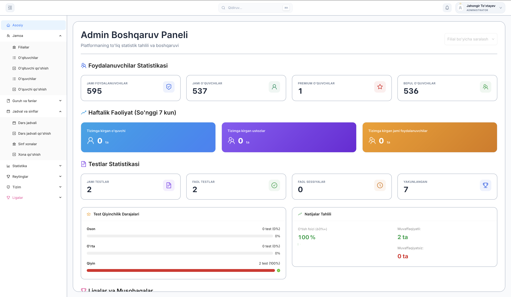
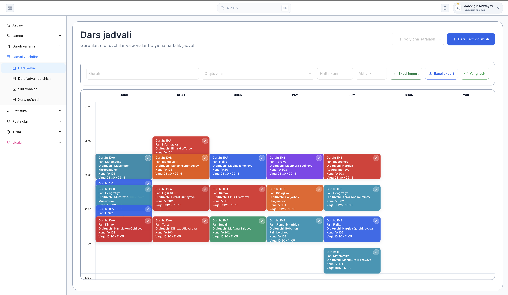
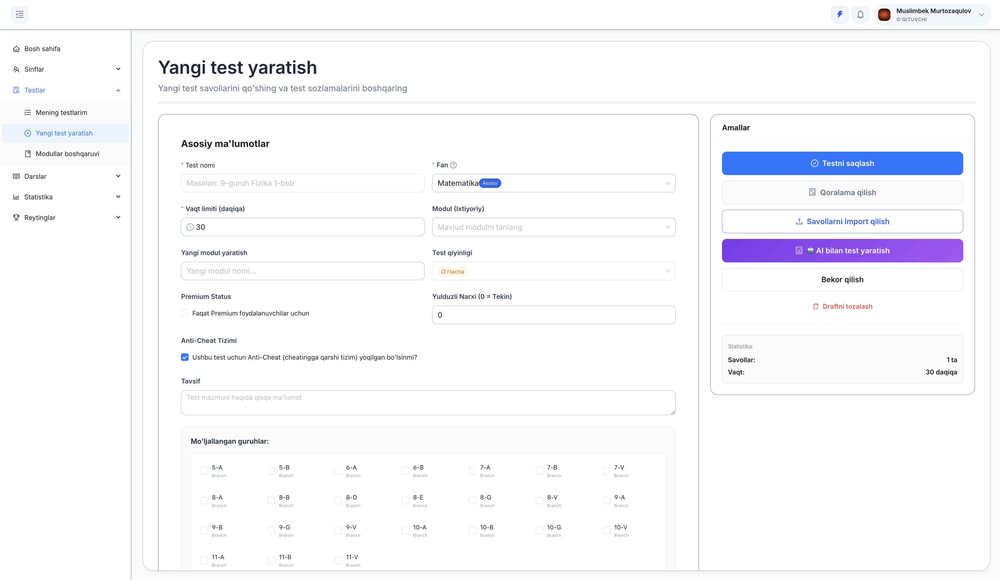
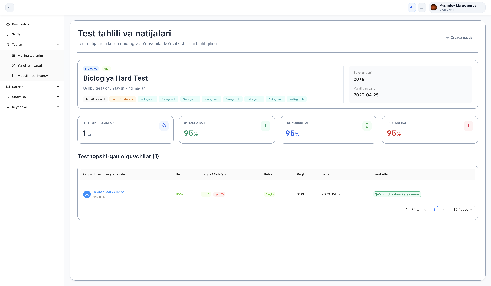
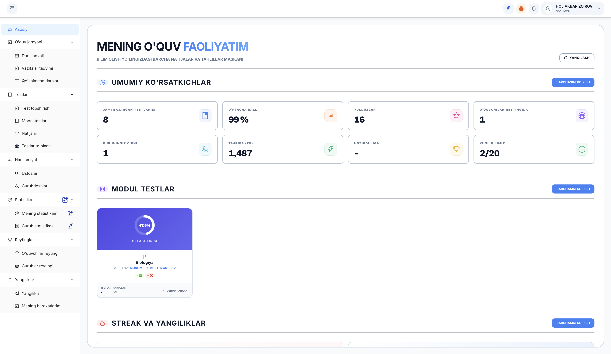
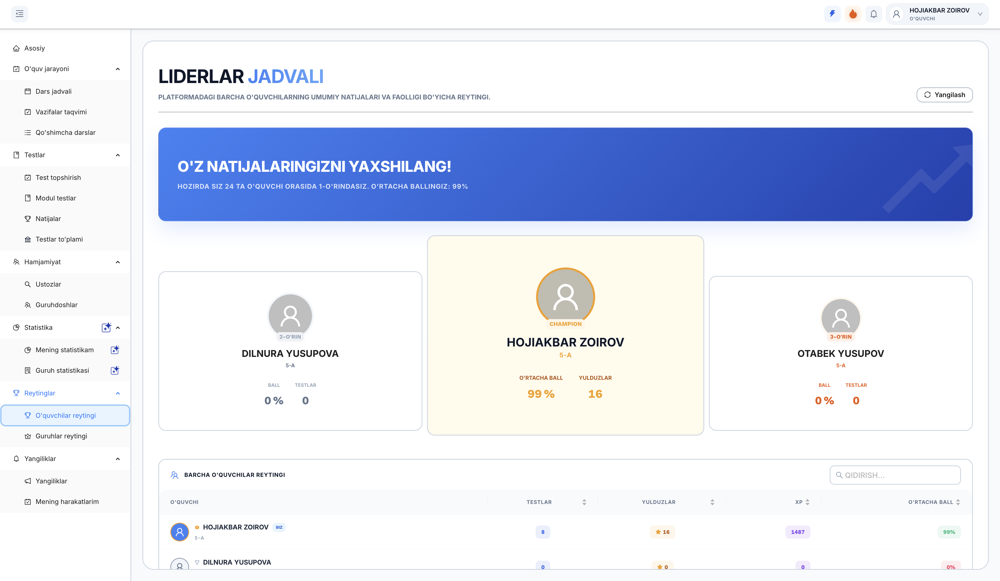
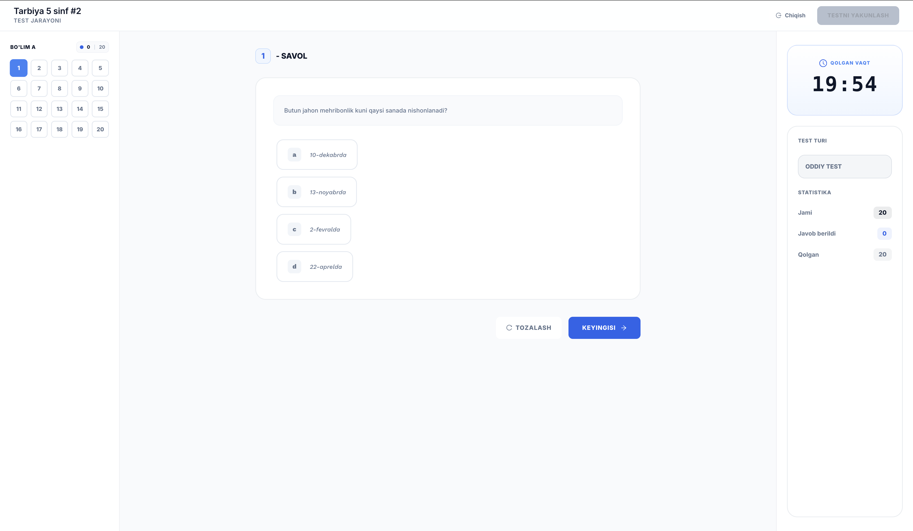
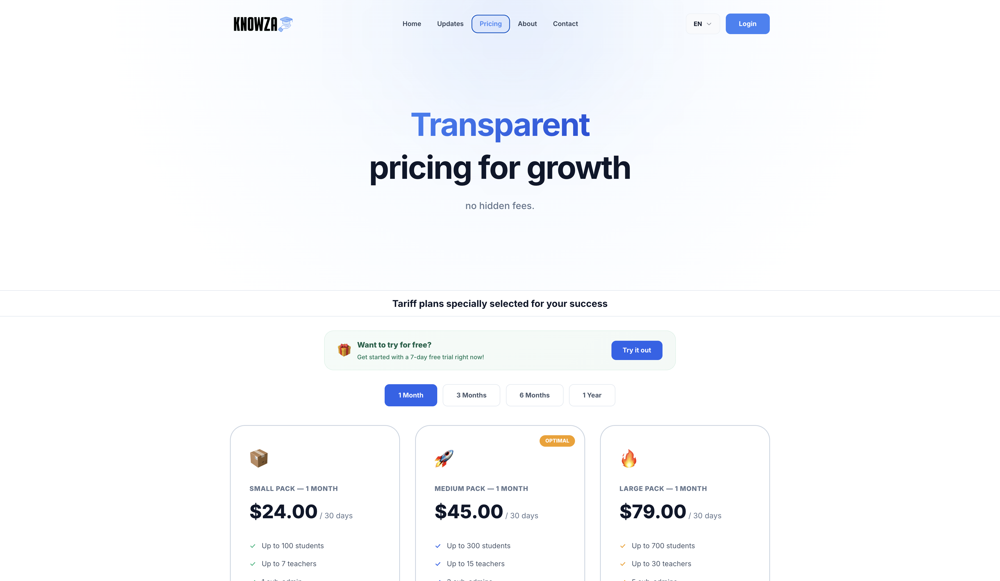

# 🎓 Knowza — Institutional EdTech & Assessment Ecosystem

[]()
[]()
[]()
[]()
[]()

**Knowza** is a unified multi-role educational SaaS platform designed for private schools and learning centers. It integrates secure online testing, academic scheduling, classroom management, student homework tracking, league gamification, and AI-assisted educational tools under a single ecosystem.

This repository serves as the centralized overview hub for the Knowza project.

---

## 📸 Platform Preview

### Admin Dashboard — Analytics & School Management
> The admin overview provides real-time statistics on students, teachers, active groups, and system activity with interactive charts.



### Class Scheduling System
> A full weekly/daily schedule grid linking classrooms, subjects, teachers, and time slots — built directly into the admin panel.



### Teacher Test Builder
> Teachers create quizzes and exams with configurable time limits, question pools, anti-cheat settings, and optional star-pricing.



### Sentinel Anti-Cheat & Exam Results
> Real-time violation tracking and detailed exam result analytics — tab switches, window blur events, and per-student scoring breakdowns.



### Student Dashboard — Daily Overview
> Students see their daily schedule, active assignments, Dynamic Island notifications, and gamification stats (XP, Stars, Streak).



### League & Gamification System
> A competitive leaderboard with XP-based rankings, levels, daily streaks, and Stars currency across student leagues.



### Live Exam Session
> The exam interface with real-time countdown, question navigation, and answer syncing — all protected by the anti-cheat layer.



### SaaS Pricing Plans
> Five-tier subscription model with feature differentiation for learning centers of different sizes.



---

## 🏛 Directory & Documentation Map

To understand different layers of Knowza, explore the links below:

*   **System Architecture Details:** [`docs/ARCHITECTURE.md`](docs/ARCHITECTURE.md) — Database models, tenant query filtering, and server-side lifecycle sequence diagrams.
*   **Public API Structure:** [`docs/API_REFERENCE.md`](docs/API_REFERENCE.md) — Secure REST endpoints for login, test sessions, anti-cheat reports, and limit checks.
*   **Feature Inventory:** [`docs/FEATURES.md`](docs/FEATURES.md) — Detailed breakdown of features per role and component.
*   **Pitch & Product Strategy:** [`presentation/PITCH_DECK.md`](presentation/PITCH_DECK.md) — Slide outline, market positioning, and SaaS monetization model.
*   **Presentation Script:** [`presentation/DEMO_FLOW.md`](presentation/DEMO_FLOW.md) — Step-by-step instructions to demonstrate the system live.
*   **Evolution Timeline:** [`updates/README.md`](updates/README.md) — Chronological releases tracker (v1.0.0 → v2.5.0).

---

## ⚙️ How Knowza Works (System Workflow)

The operational pipeline follows a sequential workflow from registration to evaluation:

```text
[1. Admin Reg] ──► [2. Setup School] ──► [3. Schedule Classes]
                                                    │
[6. Real-time Audit] ◄── [5. Student Work] ◄────────┘
```

### 1. Admin Registration & Subscription
*   The School Owner (Admin) registers their learning center on the platform.
*   The Admin selects a subscription plan (Tariff).
*   The backend establishes a unique `Organization` identifier (Tenant ID) that scopes all future database entries.

### 2. School Infrastructure Setup
*   The Admin logs into the Admin Dashboard.
*   The Admin creates classrooms (`Classrooms`), school subjects (`Subjects`), and student class groups (`Groups`).
*   The Admin registers Teachers, Sub-Admins, and Students belonging to the school. Users can be created individually or imported instantly via bulk Excel files.

### 3. Class Scheduling & Assignment
*   The Admin maps the school schedule by creating `ClassScheduleSlots` linking days, times, subjects, and classrooms.
*   The Admin assigns specific teachers to specific student groups (`TeacherClassAssignment`).

### 4. Content Creation & Assignments
*   Teachers log in to their specialized Teacher Dashboard.
*   Teachers publish homework sheets with optional file attachments (`HomeworkAttachment`).
*   Teachers build quizzes and exams using the Test Builder. They specify details like time limits, question pools, and optional star-pricing.

### 5. Student Testing, Learning & Gamification
*   Students log into the Student Dashboard.
*   Students view their schedule calendar, download homework files, and take active tests.
*   Test attempts run under server-controlled sessions (`TestSession`), syncing answers dynamically.
*   Upon submission, the server awards XP (Experience Points) and Stars, updating the student's level, daily streak, and League rankings.

### 6. Security Enforcement & Analytics Auditing
*   While students take exams, the frontend monitors tab switches and window blur events, reporting logs to the backend.
*   Admins review class ranking trends, student results, anti-cheat violations, and operational logs to monitor center activity.

---

## 🛠 Technology Stack

*   **Frontend SPA:** `Knowza`
    *   *Stack:* React 19, Vite, React Router 7, TanStack Query, Axios, Tailwind CSS 4, Ant Design, GSAP, ECharts.
*   **Backend REST API:** `Knowza-Backend`
    *   *Stack:* Django 5, Django REST Framework, SimpleJWT, PostgreSQL, Redis.

---

## 📦 Repositories

| Repository | Description | Tech |
|---|---|---|
| Knowza | Frontend SPA — Student, Teacher, Admin dashboards | React 19, Vite, Ant Design |
| Knowza-Backend | REST API — Auth, Tests, Anti-Cheat, SaaS Engine | Django 5, DRF, JWT, PostgreSQL |
| Knowza-Overview | Documentation hub — Architecture, API docs, Releases | Markdown |

---

## 📄 License

This project is licensed under the MIT License — see the [LICENSE](LICENSE) file for details.
