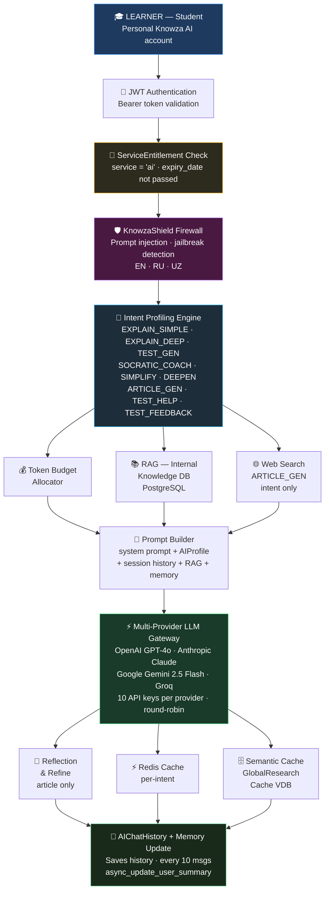
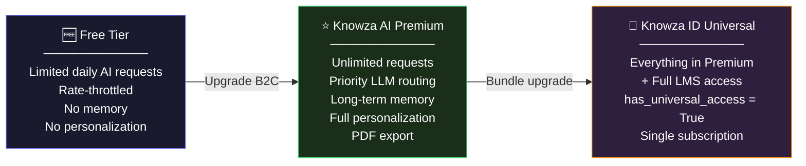
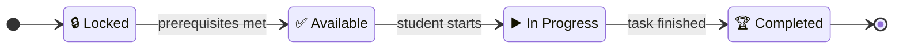
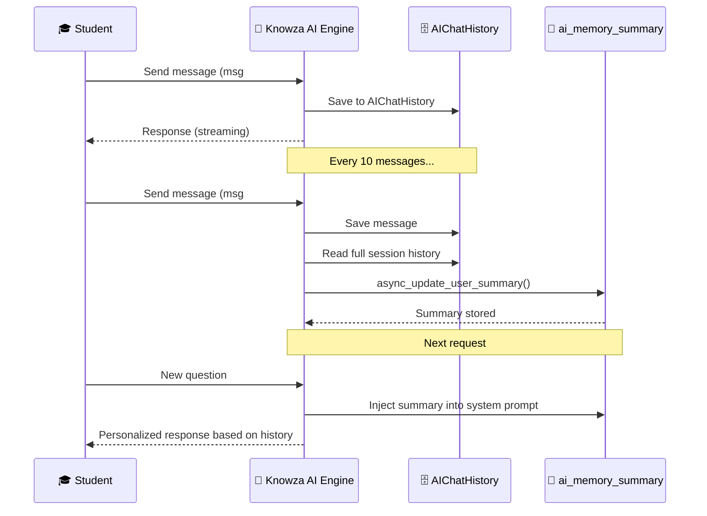

# 🤖 Knowza AI — Architecture

Knowza AI is a **completely separate platform** from Knowza LMS. It is a personal AI tutor built exclusively for learners (students). Knowza AI has its own environment, its own onboarding, its own subscription system, and its own data models — it is not part of institutional school management.

---

## 🔑 Knowza AI vs Knowza LMS — Key Distinction

| | 🤖 Knowza AI | 🏫 Knowza LMS |
|---|---|---|
| **For whom** | Students / independent learners only | Schools: admins, teachers, students |
| **Environment** | Completely separate platform | Institutional management platform |
| **Subscription** | Personal student subscription (B2C) | Institution subscription (B2B) |
| **Managed by** | The student themselves | School administrator |
| **Purpose** | Personal AI-powered learning | School management and assessment |
| **Access control** | `ServiceEntitlement` — per-user service access | `AdminTariff` — institution-level plan |

---

## 🏗 Knowza AI Architecture




---

## 🎓 Onboarding — First Step in Knowza AI

When a student first enters Knowza AI, they complete a **mandatory onboarding** flow. The data is saved to the `AIProfile` model, which is the foundation of all AI personalization.

### What is collected during onboarding (`AIProfile`):

| Field | Description | Example |
|---|---|---|
| `age_or_grade` | Student's age or grade | `"11th grade"`, `"17"` |
| `global_goal` | Primary learning target | `"IELTS"`, `"DTM"`, `"CEFR"`, `"School"` |
| `custom_goal` | Custom goal (when `global_goal = 'custom'`) | `"Medical University"` |
| `current_level` | Current proficiency | `zero` / `basic` / `advanced` |
| `learning_language` | AI response language | `uz_latin` / `uz_cyrillic` / `ru` / `mixed` |
| `subject_focus` | Primary subject | `"Mathematics"`, `"English"` |
| `target_score` | Target exam score | `"IELTS 7.5"`, `"DTM 180"` |
| `time_commitment` | Daily study time available | `"2 hours"` |
| `target_deadline` | Time to achieve goal | `"6 months"` |
| `phone` | Contact phone | — |
| `school` | School / institution name | — |
| `city` | City | `"Tashkent"` |
| `country` | Country | `"Uzbekistan"` |

> **Without completing onboarding**, the student receives a generic AI experience. Every single AI response is shaped by these fields.

---

## 🔑 Knowza AI Subscription (Separate from LMS)

Access to Knowza AI is controlled through `ExtensionService` and `ServiceEntitlement` models — **completely independently** from LMS tariffs.

```python
# ExtensionService — registers Knowza AI as a separate service
class ExtensionService:
    name = "Knowza AI"
    service_id = "ai"          # unique slug
    base_url = "..."           # Knowza AI environment URL
    is_active = True

# ServiceEntitlement — individual student's access to Knowza AI
class ServiceEntitlement:
    user = <student>
    service = <ExtensionService 'ai'>
    is_granted = True          # access granted?
    expiry_date = <datetime>   # when access expires
    metadata = {               # additional settings
        "plan": "monthly",
        "ai_calls_limit": 500
    }
```

### Access Tiers:

| Tier | How to get | What it includes |
|---|---|---|
| **Free** | Sign up for Knowza AI | Limited AI requests (rate-throttled) |
| **Knowza AI Premium** | Personal student subscription (B2C) | Full access, expanded quotas |
| **Knowza ID Universal** | `has_universal_access = True` | Full access to all Knowza services (LMS + AI) |

> **Important:** A student enrolled at a school on Knowza LMS does **NOT** automatically get Knowza AI access. These are separate purchases.




---

## 🧩 Knowza AI Core Features

### 1. AI Chat — Personal Tutor

The main feature of Knowza AI. The student asks questions; the AI responds using the full student profile.

**Endpoint:** `POST /api/knowza-ai/chat/`

```json
{
  "message": "What is an integral and how do you calculate it?",
  "session_id": "abc-123",
  "intent": null,
  "stream": true
}
```

- Supports **streaming** (SSE) and batch modes
- Saves history to `AIChatHistory` by `session_id`
- Every 10 messages — updates `ai_memory_summary` in background
- Intent detected automatically or can be set explicitly

### 2. Test Generation (Sandbox Tests)

Student specifies a topic and level — AI generates a test tailored specifically to them.

**Endpoint:** `POST /api/knowza-ai/generate_test/`

```json
{
  "topic": "Quadratic Equations",
  "difficulty": "advanced"
}
```

- Questions are calibrated to the student's `current_level` from their `AIProfile`
- Answers stored in `SandboxTest`
- After submission — `SkillGap` records are automatically updated with weak topics

### 3. Socratic Coach — Guided Error Analysis

After a wrong answer the AI does **not** give the answer immediately — it asks guiding questions.

**Endpoint:** `POST /api/knowza-ai/socratic_coach/`

```json
{
  "question": "2x + 5 = 13, x = ?",
  "user_answer": "3",
  "correct_answer": "4",
  "explanation": "..."
}
```

### 4. Learning Roadmap — Personalized Study Plan

**Endpoint:** `POST /api/knowza-ai/generate_roadmap/`

AI builds a full study roadmap based on the student's `AIProfile`:
- Analyzes: `global_goal`, `current_level`, `target_score`, `time_commitment`, `target_deadline`
- Creates a `LearningPath` with sequential `LearningNode` entries
- Each node: topic, description, estimated time, status
- `prerequisites` enforced — cannot advance to next topic without completing current



### 5. Daily Missions Queue — Daily Task List

**Endpoint:** `GET /api/knowza-ai/queue/`

- Auto-generates a daily task list from `AIQueueItem`
- Task types: `lesson`, `test`, `review`, `practice`
- Priorities: `high`, `medium`, `low` — based on skill gaps and deadline
- Linked to Roadmap nodes — completing a task advances `LearningNode` progress

**Endpoint:** `POST /api/knowza-ai/complete_queue/`

```json
{ "item_id": 42 }
```

### 6. AI Article Generation — In-Depth Research

**Endpoint:** `POST /api/knowza-ai/generate_article/`

- Intent = `ARTICLE_GEN` (maximum budget: 64K input, 8192 output tokens)
- Performs a **live web search** (top 3 results)
- Finds a relevant **YouTube video** and appends the link
- Runs a **Reflection Loop** — verifies accuracy against sources before delivery
- Result cached in `GlobalResearchCache` (semantic cache) — similar future queries return instantly

Student can save articles:
**Endpoint:** `POST /api/knowza-ai/saved_researches/`

### 7. Dashboard Stats — Personal Analytics

**Endpoint:** `GET /api/knowza-ai/dashboard_stats/`

```json
{
  "streak": {
    "current_streak": 7,
    "longest_streak": 21,
    "last_completed_date": "2026-07-18"
  },
  "skill_gaps": [
    { "skill_name": "Quadratic Equations", "subject": "Algebra", "error_count": 3, "status": "weak" }
  ],
  "profile": {
    "subject": "Mathematics",
    "target_score": "DTM 180"
  }
}
```

### 8. PDF Export

**Endpoint:** `POST /api/knowza-ai/export_pdf/`

Students can export any AI response or article to a downloadable PDF file.

---

## 🧠 Long-Term Memory System

Knowza AI **remembers** each student across sessions:



Memory controls (managed by the student):
- `is_memory_enabled = True` — allow AI to collect and update memory
- `is_ai_personalized = True` — use personalization in responses

---

## 📊 Skill Gap Tracking (`SkillGap`)

After every sandbox test, wrong answers are analyzed:

```python
# update_skill_gaps(user, results, subject)
# results = [{'skill': 'Quadratic Equations', 'is_correct': False}, ...]

# Wrong answer → error_count++, status='weak'
# Student starts answering correctly → status='ok'
```

Weak topics (`status='weak'`) affect:
1. **Daily Missions** — tasks prioritize weak topics
2. **AI Chat** — AI keeps weak topics in context when explaining
3. **Dashboard** — student sees their problem areas

---

## 📈 Streak System (Knowza AI)

Knowza AI has its **own separate streak system** via `StreakCounter`, tied to `AIProfile` (not to LMS streaks):

```python
class StreakCounter:
    profile = OneToOneField(AIProfile)   # linked to AI profile
    current_streak = IntegerField        # current active day streak
    longest_streak = IntegerField        # best streak ever
    last_completed_date = DateField      # last active day
```

Streak updates on:
- Completing a Daily Mission task
- Submitting a sandbox test
- Active AI chat interaction

---

## 🛡 KnowzaShield — AI Firewall

Every request to Knowza AI passes through the firewall before any LLM processing:

**Blocks:**
- Prompt injection attacks in English, Russian, and Uzbek
- Jailbreak patterns: `DAN mode`, `god mode`, `sudo mode`, `developer mode`
- Instruction override attempts: `ignore previous instructions`, `forget everything`, `oldingi ko'rsatmalarni unutgin`
- Identity hijacking: `you are now`, `act as`, `pretend to be`

**All blocked requests are logged** for abuse monitoring.

---

## ⚙️ Token Budget Per Intent

| Intent | Max Input | Max Output | Temperature | Timeout |
|---|---|---|---|---|
| `EXPLAIN_SIMPLE` | 8K tokens | 500 tokens | 0.3 | 15s |
| `EXPLAIN_DEEP` | 32K tokens | 2048 tokens | 0.5 | 30s |
| `TEST_GEN` | 16K tokens | 1500 tokens | 0.6 | 25s |
| `SOCRATIC_COACH` | 12K tokens | 600 tokens | 0.4 | 15s |
| `SIMPLIFY` | 10K tokens | 600 tokens | 0.3 | 15s |
| `DEEPEN` | 32K tokens | 2048 tokens | 0.5 | 30s |
| `ARTICLE_GEN` | 64K tokens | 8192 tokens | 0.3 | 60s |

---

## 🗄 Knowza AI Data Models

| Model | Purpose |
|---|---|
| `AIProfile` | Student's personal Knowza AI profile (goals, level, language) |
| `LearningPath` | Student's personalized study roadmap |
| `LearningNode` | Single topic/step in the roadmap with progress and prerequisites |
| `AIQueueItem` | Daily task (lesson / test / review / practice) |
| `SkillGap` | Student's weak topics, updated after each test |
| `StreakCounter` | Knowza AI active day streak (separate from LMS streaks) |
| `LessonSession` | Chat history for a specific topic-based study session |
| `SandboxTest` | AI-generated test with student answers and Socratic dialogue history |
| `AIChatHistory` | Full message history per session_id |
| `SavedResearch` | Student's saved AI articles and research |
| `GlobalResearchCache` | Semantic cache of AI articles shared across all users |
| `AIKnowledge` | Internal knowledge base for RAG (PostgreSQL vectors) |
| `AIUsageLog` | AI usage audit log: tokens, cost, latency, status |
| `ExtensionService` | Registers Knowza AI as a separate service in the ecosystem |
| `ServiceEntitlement` | Individual student's access grant to Knowza AI |
