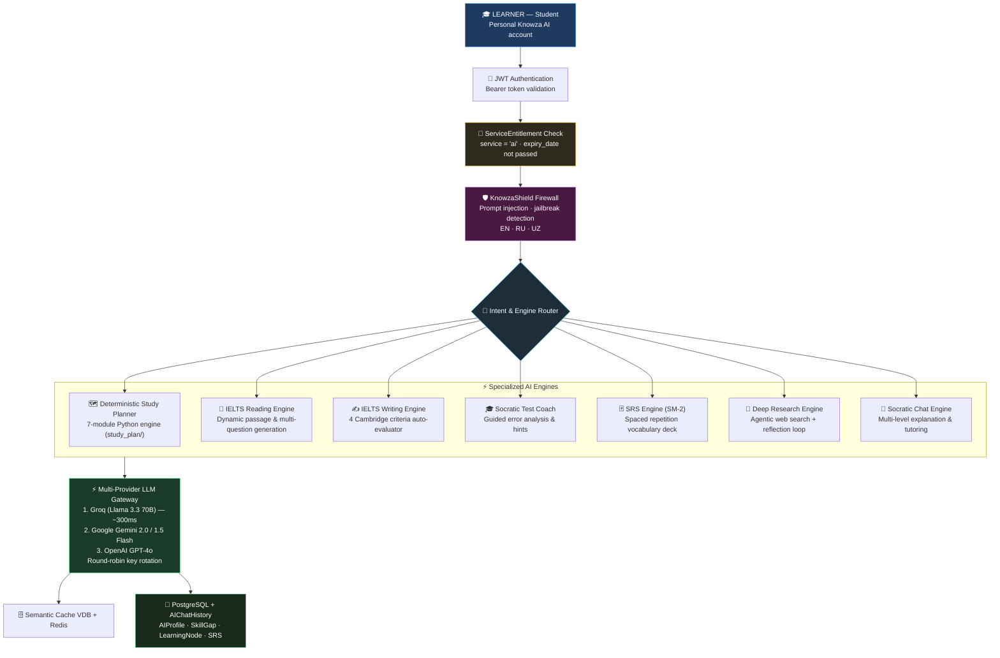

# 🤖 Knowza AI — Architecture (v3.0.0)

Knowza AI is a **completely separate platform** from Knowza LMS. It is an autonomous personal AI learning ecosystem built exclusively for students and self-directed learners. Knowza AI has its own dedicated frontend workspace, onboarding, subscription system, AI engines, and data models.

---

## 🔑 Knowza AI vs Knowza LMS — Key Distinction

| | 🤖 Knowza AI | 🏫 Knowza LMS |
|---|---|---|
| **For whom** | Students / independent learners only | Schools: admins, teachers, students |
| **Environment** | Dedicated standalone platform (`/knowza-ai/*`) | Institutional management platform |
| **Subscription** | Personal student subscription (B2C) | Institution subscription (B2B) |
| **Managed by** | The student themselves | School administrator |
| **Purpose** | Personal AI-powered learning & exam mastery | School management and assessment |
| **Access control** | `ServiceEntitlement` — per-user service access | `AdminTariff` — institution-level plan |

---

## 🏗 Knowza AI 3.0 Architecture

---

## 🎯 English Foundation Engine & 90% Mastery Progression

Knowza AI incorporates the **English Foundation Standard** (`KNOWZA_AI_SPEC.md`):
- **Core Philosophy:** *"Build English First. Exams Come Later."*
- **CEFR Learning Arc:**
  `Absolute Beginner (A0)` → `A1 (Elementary)` → `A2 (Pre-Intermediate)` → `B1 (Intermediate)` → `Strong B2 (Upper-Intermediate)`
- **90% Mastery Threshold:** A student must score ≥ 90% on a node's diagnostic exercises before the system unlocks the next learning node.
- **Cognitive Remediation:** When mastery is < 90%, the engine triggers bilingual code-switching (UZ/EN) and misinterpretation detection to explain the core rule from fresh angles.

---

## 🧩 Core AI Engine Modules

### 1. Adaptive IELTS Suite (`api/ai_engine/ielts_*`)
- **Reading Engine (`ielts_reading_engine.py`)**: Dynamically synthesizes CEFR-calibrated reading passages and 4 standard IELTS question sets (True/False/Not Given, Multiple Choice, Matching Headings, Summary Completion). Evaluates answers with band prediction (0.0–9.0).
- **Writing Engine (`ielts_writing_engine.py`)**: Assesses Task 1 & Task 2 submissions against official Cambridge descriptors (*Task Achievement, Coherence & Cohesion, Lexical Resource, Grammatical Range & Accuracy*), providing sentence-level correction and vocabulary upgrade recommendations.

### 2. Deterministic Study Planner (`api/ai_engine/study_plan/`)
- 7 modular Python components: `exam_knowledge.py`, `difficulty_engine.py`, `section_allocator.py`, `phase_builder.py`, `tier_differentiator.py`, `curriculum_bank.py`, `plan_assembler.py`.
- **Zero-Token Free Tier**: Instant (< 5ms) deterministic generation with 0 LLM token cost.
- **Token-Compressed Pro Tier**: Sends a 4-week compressed outline to the LLM for bespoke tutor strategies (>80% token savings).

### 3. Socratic Test Coach (`api/ai_engine/test_coach.py`)
- Real-time coaching during practice without giving away direct answers.
- Guides the student step-by-step using pedagogical inquiry.

### 4. Spaced Repetition System (`api/ai_engine/srs_engine.py`)
- SuperMemo SM-2 algorithm customized for vocabulary retention.
- Schedules daily flashcard reviews based on difficulty factor and repetition history.

### 5. Multi-Provider Failover Gateway (`api/ai_engine/utils.py`, `brain/`)
- Priority chain:
  1. **Groq (`llama-3.3-70b-versatile`)** — Ultra-low latency (~300-500ms)
  2. **Google Gemini 2.0 / 1.5 Flash** — Extended context and streaming
  3. **OpenAI GPT-4o** — Complex multi-step reasoning fallback
- Automatic key rotation across 10 API keys per provider with Pydantic JSON auto-repair.

---

## 💻 Complete 20-Module Frontend Topology

The Knowza AI frontend is located under `/knowza-ai/*` with 20 dedicated components:
- **`Home.jsx`** — Landing page with 3D globe and interactive feature demos
- **`Dashboard.jsx`** — Central student learning cockpit
- **`Diagnostic.jsx`** — Adaptive diagnostic assessment wizard
- **`Reading.jsx`** — IELTS Adaptive Reading interface
- **`Writing.jsx`** — IELTS Writing workspace with live criteria scoring
- **`Tutor.jsx`** — 24/7 Socratic conversational tutor
- **`Planner.jsx`** — 4-phase interactive study roadmap
- **`FlashCards.jsx`** — Spaced repetition flashcard deck
- **`Research.jsx`** — Scientific research studio with TOC and PDF export
- **`MockExam.jsx`** — Timed full-length mock examinations
- **`Lesson.jsx`** — Atomic interactive lesson classroom
- **`Test.jsx`** — Practice assessment runner with hints
- **`Analytics.jsx`** — Cognitive analytics & skill gap radar
- **`Onboarding.jsx`** — Student persona & goal setup workflow
- **`Login.jsx`** — Standalone student authentication
- **`Layout.jsx`** — Sidebar & shell layout with quota monitor
- **`Profile.jsx`** — Profile management & AI memory controls
- **`Pro.jsx`** — Subscription tier upgrade center
- **`Guide.jsx`** — Comprehensive platform manual
- **`Search.jsx`** — Global notes and knowledge search

---

## 🗄 Knowza AI Data Models

| Model | Purpose |
|---|---|
| `AIProfile` | Student's personal profile (CEFR level, goals, target score, study hours) |
| `LearningPath` | Student's personalized study roadmap |
| `LearningNode` | Atomic micro-skill topic in the roadmap with mastery status |
| `SkillGap` | Weak topics and error gap history updated after each test |
| `StreakCounter` | Active daily learning streak counter |
| `IELTSWritingTask` | Generated IELTS writing task prompts (Task 1 / Task 2) |
| `IELTSWritingSubmission` | Student submitted essay text and time spent |
| `IELTSWritingEvaluation` | AI evaluation breakdown across 4 Cambridge criteria |
| `IELTSReadingPassage` | Generated reading passage with structured questions |
| `IELTSReadingAttempt` | Student answers, score, and band rating |
| `AIChatHistory` | Conversation message history per session |
| `SavedResearch` | Saved deep research articles with metadata |
| `GlobalResearchCache` | Semantic vector cache for research articles |
| `ExtensionService` | Service descriptor registering Knowza AI in ecosystem |
| `ServiceEntitlement` | Per-student access entitlement and quota records |
