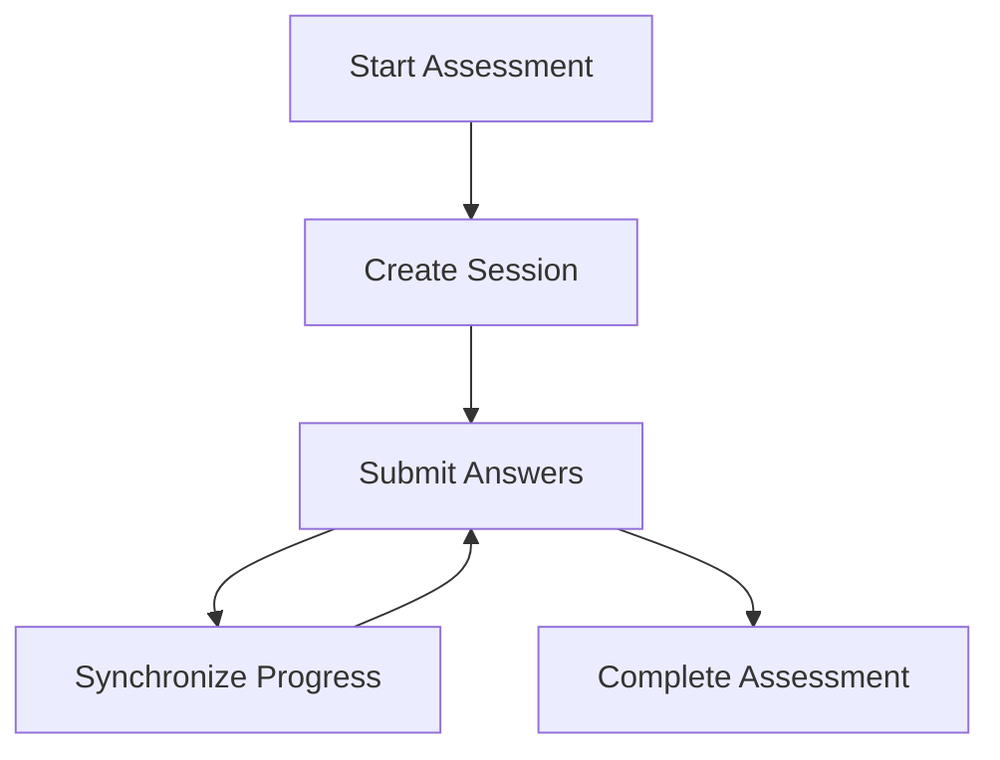
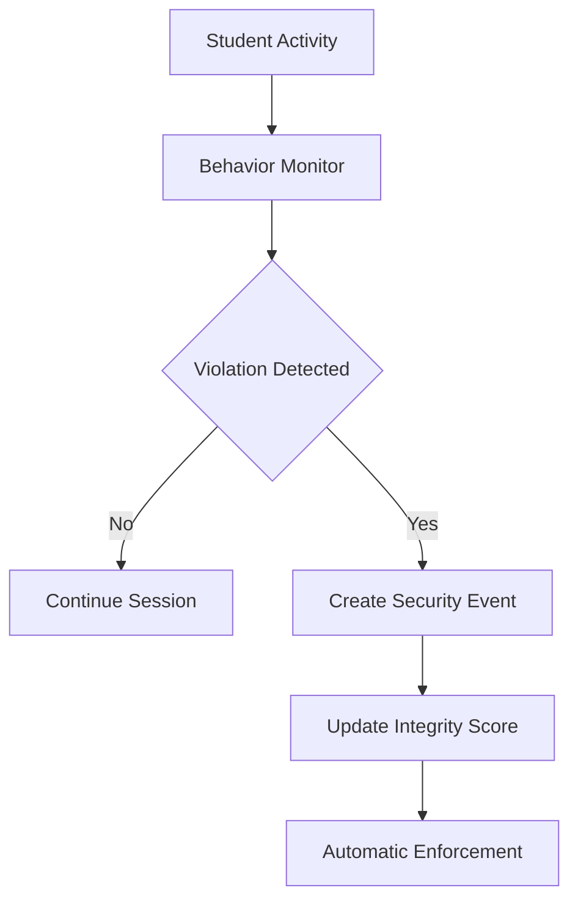
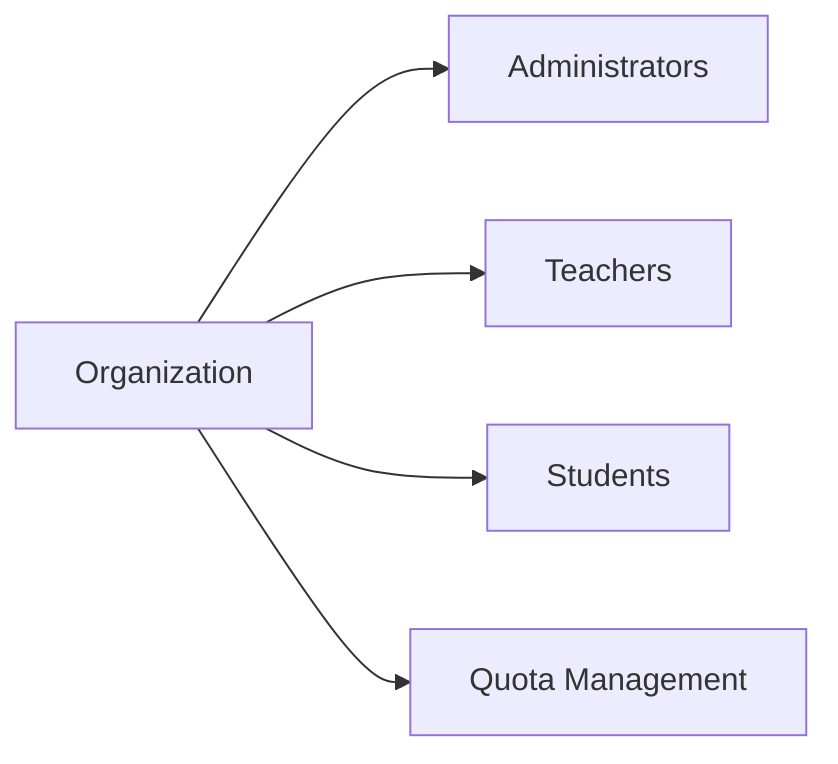
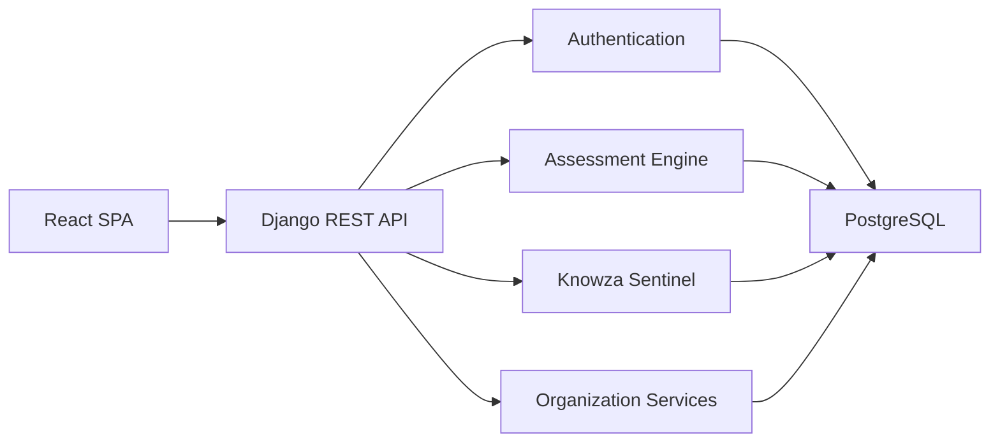

````md
# 🛰 API Reference (Conceptual Overview)

This section presents a high-level overview of the primary API domains powering the Knowza educational ecosystem.

> [!NOTE]
> To protect platform security, all endpoints, payload structures, and identifiers shown below are illustrative abstractions and do not reflect the exact production implementation.

---

## 🔐 Authentication & Identity Services

Authentication services manage user access, session creation, role assignment, and profile retrieval.

```mermaid
flowchart LR
    A[User Login] --> B[Authentication Service]
    B --> C[JWT Access Token]
    C --> D[Protected API Resources]
````

### Core Capabilities

| Feature           | Purpose                             |
| ----------------- | ----------------------------------- |
| User Login        | Authenticate platform users         |
| Token Refresh     | Renew access sessions               |
| Profile Retrieval | Load user context and preferences   |
| Role Validation   | Verify permissions and access scope |

### Example Authentication Request

```json
{
  "username": "user@example.com",
  "password": "••••••••"
}
```

### Example Authentication Response

```json
{
  "access_token": "jwt_token",
  "user_role": "student",
  "organization_id": 42
}
```

---

## 📝 Assessment Session Services

Assessment services power examination lifecycle management, answer synchronization, and session persistence.



### Core Capabilities

| Feature                | Purpose                         |
| ---------------------- | ------------------------------- |
| Session Initialization | Create examination sessions     |
| Progressive Save       | Prevent answer loss             |
| Session Recovery       | Restore interrupted assessments |
| Result Processing      | Calculate final outcomes        |

### Example Session Payload

```json
{
  "exam_id": 12
}
```

### Example Session Response

```json
{
  "session_id": "session_token",
  "expires_at": "2026-06-05T12:45:00Z",
  "total_questions": 20
}
```

---

## 🛡 Examination Integrity Services (Knowza Sentinel)

Knowza Sentinel continuously monitors assessment activity and records integrity-related events.



### Monitored Events

* Browser focus changes
* Tab switching activity
* Visibility state transitions
* Suspicious navigation patterns
* Session abuse attempts

### Example Integrity Event

```json
{
  "event_type": "focus_loss",
  "session_id": "session_token"
}
```

---

## 🏫 Organization Administration Services

Administrative services provide tenant management, user provisioning, and subscription quota monitoring.



### Core Capabilities

| Feature               | Purpose                      |
| --------------------- | ---------------------------- |
| User Management       | Manage organization members  |
| Quota Monitoring      | Track subscription limits    |
| Role Assignment       | Control platform permissions |
| Branch Administration | Manage educational locations |

### Example Quota Response

```json
{
  "tier": "Premium",
  "students_limit": 500,
  "teachers_limit": 30,
  "active_students": 438
}
```

---

## 🌐 API Architecture Overview



The API ecosystem follows a secure server-authoritative architecture where all business-critical operations are validated and executed on backend infrastructure before persistence.

```
```
