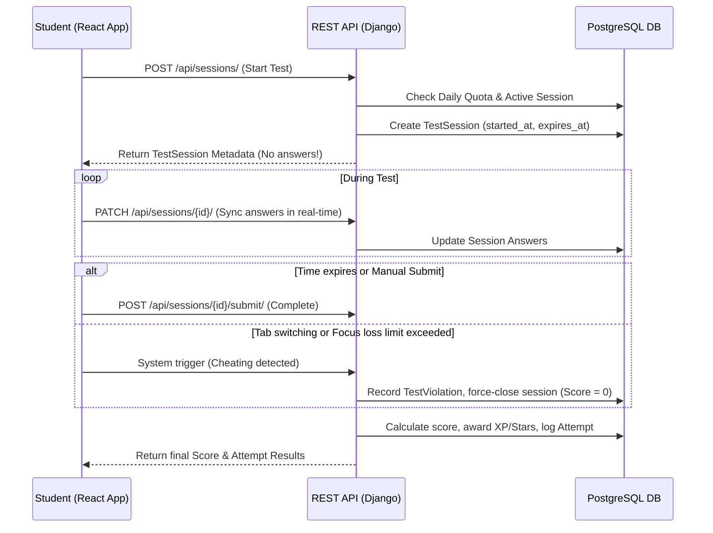

# 🏗 System Architecture & Security Isolation

This document outlines the high-level architecture, database schemas, and data security models implemented across the Knowza educational platform.

---

## 🏛 1. Multi-Tenant Isolation Model

Knowza is a multi-tenant SaaS application where multiple schools or learning centers (tenants) share the same application instance and database. Maintaining absolute isolation between these tenants is critical.

### Data Scoping
Each model containing tenant-specific records (e.g., `Student`, `Teacher`, `Group`, `Subject`, `Classroom`, `Test`) is associated with an `Organization` (tenant ID).
*   **Queryset Scoping:** Instead of filtering by organization manually in every Django view, data access is handled via **Selectors** and **Mixins** that automatically apply tenant-based scoping filters.
*   **Administrative Scope:** An `Admin` user can only search, import, or modify users belonging to their own `Organization`.
*   **Isolation Level:** Students and teachers from School A cannot view classes, test materials, or profiles from School B.

---

## 🛡 2. Server-Authoritative Test Session & Anti-Cheat

One of Knowza's biggest technical advantages is its backend-driven assessment system. Client-side variables (such as client time or browser state) are never trusted for test calculations.

### Test Session Lifecycle



### Knowza Sentinel (Anti-Cheat Engine)
The frontend monitors student behavior using browser API listeners:
*   `visibilitychange`: Fires when the student switches tabs or minimizes the browser.
*   `blur`: Fires when the student clicks outside the test window.
*   **Action:** When a violation is triggered, the frontend increments the violation count and syncs it with the backend via `POST /api/test-violations/`.
*   **Progressive Bans:** The backend registers violations. If a student exceeds the allowed limit of violations, the system creates a `TestBan` records:
    *   Fills active session scores with `0`.
    *   Bans the student from taking any tests for a set duration (e.g., 24 hours, custom configurations).

---

## ⚡ 3. Database ERD Overview (Key Models)

The backend organizes data around several core model clusters:

```text
                  ┌───────────────────┐
                  │    Organization   │ (Tenant)
                  └─────────┬─────────┘
                            │
        ┌───────────────────┼───────────────────┐
        ▼                   ▼                   ▼
┌──────────────┐    ┌──────────────┐    ┌──────────────┐
│  User (Auth) │    │  Classroom   │    │   Subject    │
└───────┬──────┘    └──────────────┘    └──────────────┘
        │
        ├───────────────┬───────────────────────┐
        ▼               ▼                       ▼
┌──────────────┐┌──────────────┐        ┌──────────────┐
│ AdminTariff  ││ TestAttempt  │        │    Group     │
└──────────────┘└───────┬──────┘        └───────┬──────┘
                        │                       │
                        ▼                       ▼
                ┌──────────────┐        ┌──────────────┐
                │ TestSession  │        │   Homework   │
                └──────────────┘        └──────────────┘
```

### Key Models & Fields
1.  **User Model:** Custom User model extending Django's `AbstractUser`, tracking `role` (head_admin, admin, sub_admin, teacher, student, seller, content_manager), `organization`, and `is_online`.
2.  **Test & Question Models:** Multi-choice, short-answer, and true/false question banks. Supports images, options structures, and KaTeX formatting.
3.  **Monetization Models:**
    *   `AdminTariff`: SaaS tiers governing administrative limits (e.g., max students/teachers).
    *   `PremiumPurchase` & `StarPackage`: Audit ledger for purchases, stars, and reward refund transactions.

---

## 🚀 4. Performance Optimization Architecture

To handle hundreds of concurrent test takers without backend lag, we implemented several performance-oriented optimizations:

### N+1 Query Resolution
In legacy code, rendering dashboard lists triggered separate database queries for every user, test, and group.
*   **Fix:** Integrated `select_related` for foreign key relationships (e.g., user profiles, test sessions) and `prefetch_related` for many-to-many relationships (e.g., classrooms, subjects).
*   **Result:** Reduced query counts by up to **80%** on complex list views.

### Caching Architecture
*   **Analytical Cache:** Analytics calculations (e.g., student ranking, class progress averages) are cached.
*   **Version-Based Invalidation:** Caches expire dynamically. When modifications occur (e.g., a test is completed), a cache version key is updated, forcing cache refreshes only when data changes.
