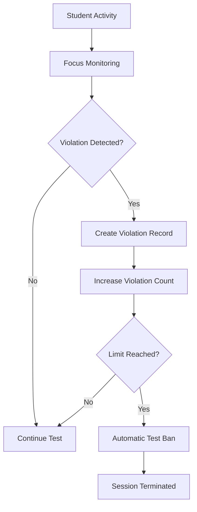

# Knowza Public Architecture Overview

This document provides a public-safe architectural blueprint of the Knowza Educational Platform, outlining the frontend and backend systems, data layers, and overall security isolation patterns.

---

## 1. High-Level Blueprint

```text
  ┌────────────────────────────────────────────────────────┐
  │                        Browser                         │
  └───────────────────────────┬────────────────────────────┘
                              │ HTTP / JSON / JWT
                              ▼
  ┌────────────────────────────────────────────────────────┐
  │                    React/Vite SPA                      │ (Client Side)
  └───────────────────────────┬────────────────────────────┘
                              │ REST API
                              ▼
  ┌────────────────────────────────────────────────────────┐
  │                 Django REST API Backend                │ (Server Side)
  │                                                        │
  │  * Authentication & Custom User Model                  │
  │  * Tenant Scoping Selector Layers                      │
  │  * Server-Side Test Session Lifecycle                  │
  │  * Anti-Cheat Sentinel Logs & Bans                     │
  │  * Automated Threaded Email Engine                     │
  │  * AI Integration Endpoints & Limit Controls           │
  └───────────────────────────┬────────────────────────────┘
                              │ ORM Queries
                              ▼
  ┌────────────────────────────────────────────────────────┐
  │       PostgreSQL DB / Cache Cache / Media Storage      │ (Data Layer)
  └────────────────────────────────────────────────────────┘
```

---

## 2. Frontend Layer (React SPA)
The client application is built as a single-page React 19 web app compiled with Vite.

### Core Modules
*   **State & Sync:** Employs TanStack React Query to synchronise server state with local memory, managing updates, caching, and fetch retries.
*   **Routing:** React Router governs role-specific dashboard views (`/knowza/test-platform/admin/*`, `/teacher/*`, `/student/*`), checking permissions dynamically.
*   **Themes & Styling:** Standardised using Tailwind CSS 4, styled layouts (MUI, Radix, Ant Design), and sleek entry animations.
*   **Localisation:** Manages translations across three languages (`en`, `ru`, `uz`) using `i18next`.

---

## 3. Backend Layer (Django REST Framework)
The server coordinates the business logic, tenant separations, and database records.

### Core Architecture
*   **Identity Models:** Custom User model extending standard Django `AbstractUser`, tracking roles, organizations, and user online status.
*   **Tenant Filtering:** Ensures security by filtering queryset outputs. Custom serializers and selectors verify that an institution admin cannot fetch, alter, or search users outside their own school ID scope.
*   **Optimization Layer:** Eliminates N+1 database bottlenecks inside serializers using pre-optimized `select_related` and `prefetch_related` queries.
*   **Queue Operations:** Leverages threaded execution queues to handle bulk email updates, registration codes, support notifications, and tariff requests.

---

## 4. Integrity Systems (Sessions & Anti-Cheat)
To maintain academic credibility, the testing module runs under a backend-authoritative architecture.
*   **TestSession:** When a student begins a test, the server writes a `TestSession` containing absolute duration constraints and daily quotas.
*   **Answer Syncing:** Standard PATCH endpoints sync answers continuously. If a browser crashes, session data is restored directly from the server.
*   **Knowza Sentinel:** Monitors window focus changes. Browser warnings notify students, and repeated tab shifts register `TestViolation` database records, triggering an automatic `TestBan` that terminates the session with a 0-score.

---

## 5. Monetization & SaaS Framework
*   **B2B Quota Controls:** An `AdminTariff` enforces limits on local users, classrooms, and subjects.
*   **B2C Micro-Transactions:** A dynamic star-ledger ledger logs student premium updates, star purchases, and course unlocks, with built-in refund audits.

---

## 6. Formal Mathematical & Algorithmic Data Exchange Model

For academic and formal system audits, the data exchange pipeline between the client SPA ($C$) and backend services ($S$) can be modeled as a **Server-Authoritative Finite State Machine (FSM)** with monotonic integrity checks and strict relational database partitioning.

# Knowza Public Architecture Overview

This document provides a public-safe architectural blueprint of the Knowza Educational Platform, outlining the frontend and backend systems, data layers, and overall security isolation patterns.

---

## 1. High-Level Blueprint

```text
  ┌────────────────────────────────────────────────────────┐
  │                        Browser                         │
  └───────────────────────────┬────────────────────────────┘
                              │ HTTP / JSON / JWT
                              ▼
  ┌────────────────────────────────────────────────────────┐
  │                    React/Vite SPA                      │ (Client Side)
  └───────────────────────────┬────────────────────────────┘
                              │ REST API
                              ▼
  ┌────────────────────────────────────────────────────────┐
  │                 Django REST API Backend                │ (Server Side)
  │                                                        │
  │  * Authentication & Custom User Model                  │
  │  * Tenant Scoping Selector Layers                      │
  │  * Server-Side Test Session Lifecycle                  │
  │  * Anti-Cheat Sentinel Logs & Bans                     │
  │  * Automated Threaded Email Engine                     │
  │  * AI Integration Endpoints & Limit Controls           │
  └───────────────────────────┬────────────────────────────┘
                              │ ORM Queries
                              ▼
  ┌────────────────────────────────────────────────────────┐
  │       PostgreSQL DB / Cache Cache / Media Storage      │ (Data Layer)
  └────────────────────────────────────────────────────────┘
```

---

## 2. Frontend Layer (React SPA)
The client application is built as a single-page React 19 web app compiled with Vite.

### Core Modules
*   **State & Sync:** Employs TanStack React Query to synchronise server state with local memory, managing updates, caching, and fetch retries.
*   **Routing:** React Router governs role-specific dashboard views (`/knowza/test-platform/admin/*`, `/teacher/*`, `/student/*`), checking permissions dynamically.
*   **Themes & Styling:** Standardised using Tailwind CSS 4, styled layouts (MUI, Radix, Ant Design), and sleek entry animations.
*   **Localisation:** Manages translations across three languages (`en`, `ru`, `uz`) using `i18next`.

---

## 3. Backend Layer (Django REST Framework)
The server coordinates the business logic, tenant separations, and database records.

### Core Architecture
*   **Identity Models:** Custom User model extending standard Django `AbstractUser`, tracking roles, organizations, and user online status.
*   **Tenant Filtering:** Ensures security by filtering queryset outputs. Custom serializers and selectors verify that an institution admin cannot fetch, alter, or search users outside their own school ID scope.
*   **Optimization Layer:** Eliminates N+1 database bottlenecks inside serializers using pre-optimized `select_related` and `prefetch_related` queries.
*   **Queue Operations:** Leverages threaded execution queues to handle bulk email updates, registration codes, support notifications, and tariff requests.

---

## 4. Integrity Systems (Sessions & Anti-Cheat)
To maintain academic credibility, the testing module runs under a backend-authoritative architecture.
*   **TestSession:** When a student begins a test, the server writes a `TestSession` containing absolute duration constraints and daily quotas.
*   **Answer Syncing:** Standard PATCH endpoints sync answers continuously. If a browser crashes, session data is restored directly from the server.
*   **Knowza Sentinel:** Monitors window focus changes. Browser warnings notify students, and repeated tab shifts register `TestViolation` database records, triggering an automatic `TestBan` that terminates the session with a 0-score.

---

## 5. Monetization & SaaS Framework
*   **B2B Quota Controls:** An `AdminTariff` enforces limits on local users, classrooms, and subjects.
*   **B2C Micro-Transactions:** A dynamic star-ledger ledger logs student premium updates, star purchases, and course unlocks, with built-in refund audits.

---

## 6. Formal Mathematical & Algorithmic Data Exchange Model

For academic and formal system audits, the data exchange pipeline between the client SPA ($C$) and backend services ($S$) can be modeled as a **Server-Authoritative Finite State Machine (FSM)** with monotonic integrity checks and strict relational database partitioning.

````md
### 6.1 State Synchronization & Session Lifecycle

The examination system follows a server-authoritative session model. All answer submissions, session validations, and integrity checks are processed by the backend before being persisted.

```mermaid
flowchart TD
    A[Student Starts Test] --> B[Session Created]
    B --> C[Submit Answer]
    C --> D[Backend Validation]

    D --> E{Session Valid?}

    E -->|Yes| F[Store Answer]
    F --> G[Sync Updated State]
    G --> C

    E -->|No| H[Reject Update]
    H --> I[Terminate Session]
````

The server automatically rejects updates if:

* The session expiration time has been reached.
* The integrity violation threshold has been exceeded.
* The session has already been terminated.

This architecture guarantees that examination state cannot be manipulated directly from the client.

---

### 6.2 Multi-Tenant Security & Access Control

Knowza enforces strict tenant isolation and role-based authorization for every request.

```mermaid
flowchart LR
    A[User Request] --> B[Authentication]
    B --> C[Organization Check]
    C --> D[Role Validation]

    D --> E{Authorized?}

    E -->|Yes| F[Access Resource]
    E -->|No| G[403 Forbidden]
```

#### Role Hierarchy

```text
Student
   │
   ▼
Teacher
   │
   ▼
Branch Manager
   │
   ▼
Administrator
```

Security principles:

* Users can access only data belonging to their organization.
* Role permissions are enforced on every endpoint.
* Unauthorized requests are rejected and logged.
* Cross-tenant access is blocked by default.

---

### 6.3 Real-Time Integrity Monitoring (Knowza Sentinel)

Knowza Sentinel continuously monitors examination activity and records integrity-related events.



Monitored events include:

* Browser tab switching
* Window focus loss
* Visibility changes
* Suspicious navigation behavior

To reduce false positives, the system applies configurable tolerance thresholds before recording violations.

```
```
