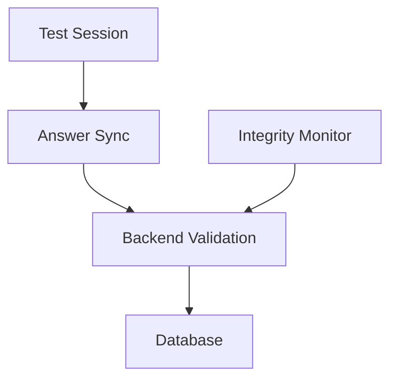
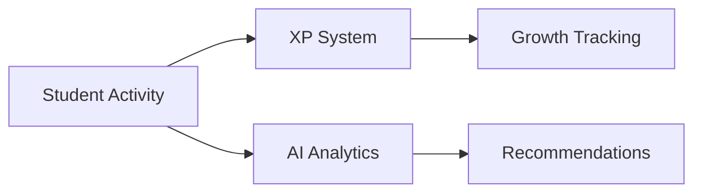
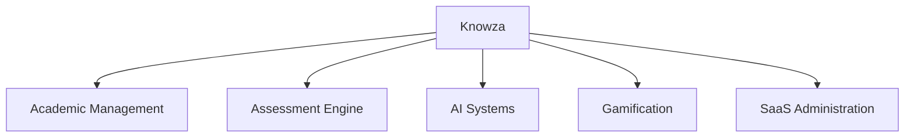

# ✨ Knowza Feature Ecosystem

Knowza is an educational operating system designed for schools, learning centers, teachers, and students. The platform combines academic management, assessment infrastructure, AI-powered learning tools, and engagement systems into a unified ecosystem.

---

## 🌍 Platform Experience

Knowza delivers a modern SaaS experience for educational institutions through a responsive multilingual interface and centralized workspace architecture.

### Public Platform

- Marketing website
- Pricing and subscription pages
- FAQ and support resources
- Product documentation
- News and platform updates
- Contact and inquiry channels

### Localization

The platform is fully localized for:

- 🇺🇸 English
- 🇷🇺 Russian
- 🇺🇿 Uzbek

### User Experience

- Responsive design across devices
- Dark-mode optimized interface
- Smooth page transitions and animations
- Accessibility-focused navigation
- Consistent design system

```mermaid
flowchart LR
    A[Website] --> B[Authentication]
    B --> C[Role Workspace]
    C --> D[Academic Services]
````

---

## 🏫 Academic Management System

Knowza provides educational institutions with centralized management tools for organizing students, teachers, classrooms, and academic operations.

### Organization Management

* School administration
* Branch administration
* Teacher assignment
* Student enrollment
* Subject management
* Classroom management
* Group organization

### Academic Operations

* Lesson scheduling
* Homework management
* Attendance tracking
* Grade monitoring
* Academic analytics
* Activity reporting

```mermaid
flowchart TD
    A[Institution]
    A --> B[Teachers]
    A --> C[Students]
    A --> D[Subjects]
    A --> E[Classrooms]
    A --> F[Schedules]
```

---

## 📝 Assessment & Integrity Infrastructure

The assessment engine operates using a server-authoritative architecture designed to ensure fairness, reliability, and examination integrity.

### Assessment Services

* Custom test creation
* Multiple question types
* Image-based questions
* Mathematical notation support
* Assignment publishing
* Progressive answer synchronization

### Knowza Sentinel

* Browser focus monitoring
* Tab switching detection
* Session violation tracking
* Automated enforcement rules
* Integrity auditing

### Session Protection

* Automatic recovery after refresh
* Server-side answer validation
* Controlled session expiration
* Real-time synchronization



---

## 🤖 AI & Student Growth Systems

Knowza integrates artificial intelligence and gamification systems to improve learning outcomes and long-term engagement.

### AI Services

* AI Test Generation
* AI Learning Assistant
* AI Study Planning
* AI Performance Analytics
* Personalized Recommendations

### Student Progression

* Experience Points (XP)
* Learning Streaks
* Weekly Leagues
* Achievement Systems
* Virtual Currency

### Premium Ecosystem

* Premium assessments
* Profile customization
* Star marketplace
* Reward systems



---

## 🚀 Unified Educational Ecosystem

Knowza brings together administration, learning management, assessment infrastructure, artificial intelligence, and student engagement into a single integrated platform.



```
```
