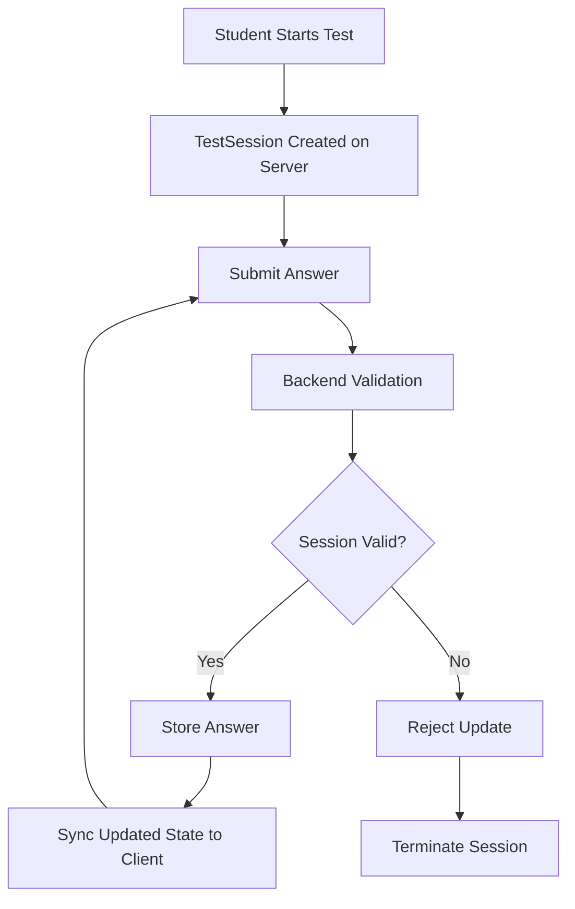
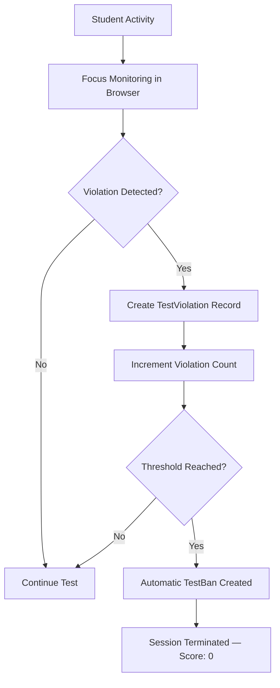
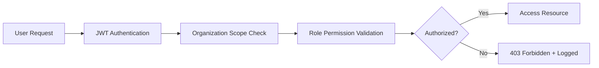
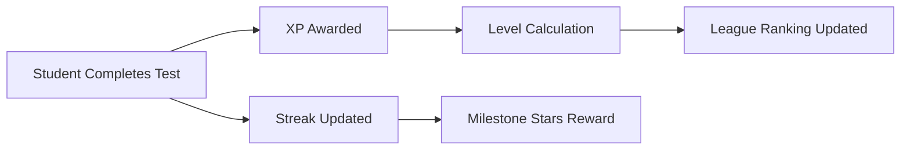

# Knowza LMS — Architecture Overview

This document describes the technical architecture of **Knowza LMS** — the institutional management and assessment layer of the Knowza ecosystem. For the AI-specific architecture, see [`AI_ARCHITECTURE.md`](AI_ARCHITECTURE.md).

---

## 1. High-Level Blueprint

```text
  ┌────────────────────────────────────────────────────────┐
  │                        Browser                         │
  └───────────────────────────┬────────────────────────────┘
                              │ HTTP / JSON / JWT
                              ▼
  ┌────────────────────────────────────────────────────────┐
  │                    React/Vite SPA                      │   (Client Side)
  │   Admin · Branch Admin · Teacher · Student dashboards  │
  └───────────────────────────┬────────────────────────────┘
                              │ REST API
                              ▼
  ┌────────────────────────────────────────────────────────┐
  │                 Django REST API Backend                │   (Server Side)
  │                                                        │
  │  * Custom Multi-Role User Model (7 roles)              │
  │  * Multi-Tenant Scoping & Isolation Layer              │
  │  * Server-Authoritative Test Session Lifecycle         │
  │  * Knowza Sentinel — Anti-Cheat Engine                 │
  │  * Automated Threaded Email Engine                     │
  │  * SaaS Tariff & B2B Billing Engine                    │
  │  * Gamification Engine (XP, Stars, Streaks, Leagues)   │
  └───────────────────────────┬────────────────────────────┘
                              │ ORM Queries
                              ▼
  ┌────────────────────────────────────────────────────────┐
  │         PostgreSQL · Redis Cache · Media Storage       │   (Data Layer)
  └────────────────────────────────────────────────────────┘
```

---

## 2. Frontend Layer (React SPA)

The client application is built as a single-page React 19 app compiled with Vite. It delivers separate role-specific workspaces under a unified URL namespace.

### Core Modules
- **State & Sync:** TanStack React Query v5 for server-state synchronization, caching, and background refetching
- **Routing:** React Router 7 with role-based route guards (`/admin/*`, `/teacher/*`, `/student/*`)
- **UI System:** Tailwind CSS 4, Ant Design, Radix UI, GSAP animations
- **Localization:** Full 3-language support (`en`, `ru`, `uz`) via i18next across 226+ translation files

---

## 3. Backend Layer (Django REST Framework)

### Identity & Roles
- **Custom User Model** extends Django's `AbstractUser` with 7 distinct roles:
  - `head_admin` → platform superuser
  - `admin` → school/learning center owner
  - `branch_admin` → branch-level manager
  - `teacher` → educator with test/homework creation rights
  - `student` → learner with exam/league participation rights
  - `seller` → premium sales commission partner
  - `content_manager` → platform content management

### Multi-Tenant Isolation (`IsolatedManager`)
The system enforces strict per-organization data isolation at the ORM level via a custom `IsolatedManager`. Every queryset is automatically scoped by the thread-local authenticated user:

```
head_admin    → sees all data globally
admin         → sees only users/data created by their own organization tree
branch_admin  → sees only users/data created by their branch
teacher       → sees only their own students
student       → sees only their own data + classmates in the same organization
```

Cross-tenant access is **blocked by default** at the database query layer — not just at the view layer.

### Optimization Layer
- All serializers use pre-optimized `select_related` and `prefetch_related` to eliminate N+1 query bottlenecks
- Annotated querysets for computed fields (e.g., `has_active_ban`) to avoid repeated subqueries in list views

### Email Engine
- Thread-pool-based email queue for bulk operations (registrations, reports, receipts, support)
- Integrated with Brevo SMTP relay with environment-configurable credentials

---

## 4. Assessment & Integrity System

### Server-Authoritative Session Model

When a student starts a test, the backend creates a `TestSession` record with absolute server-side expiry. All answer submissions are validated against this session before being persisted.



The server rejects updates if:
- The session expiration time has been reached
- The integrity violation threshold has been exceeded
- The session has already been terminated

### Knowza Sentinel — Anti-Cheat Engine



Monitored events:
- Browser tab switching
- Window focus loss
- Visibility API state changes
- Suspicious navigation patterns

---

## 5. Multi-Tenant Security Model



### Role Hierarchy

```text
Student
   │
   ▼
Teacher
   │
   ▼
Branch Admin
   │
   ▼
Admin
   │
   ▼
Head Admin
```

---

## 6. SaaS & Monetization Layer

### B2B Institution Subscriptions (`AdminTariff`)
- Multi-tier subscription plans (5 tiers) scoped to student count, branch count, and feature set
- Automated tariff expiry detection — expired institution access blocks all sub-users
- Dynamic B2B invoice generation with JWT-secured document links

### B2C Student Micro-Transactions (Stars Economy)
- Students earn Stars by completing tests, reaching streak milestones, and participating in leagues
- Stars are spent on: premium profile customization, emoji packs, profile status, premium test unlocks
- Full refund audit trail via `StarLedger` model

---

## 7. Gamification System



| Component | Description |
|---|---|
| **XP** | Awarded per test completion, drives level progression |
| **Streaks** | Daily login + test activity chain; rewards at 7/30/90/180/365 days |
| **Stars** | Premium currency; earned from exams and milestones, spent in marketplace |
| **Leagues** | Weekly season-based divisions; XP-based leaderboards with tier promotions |
| **Levels** | Unlocked by cumulative XP; displayed on student profile |
