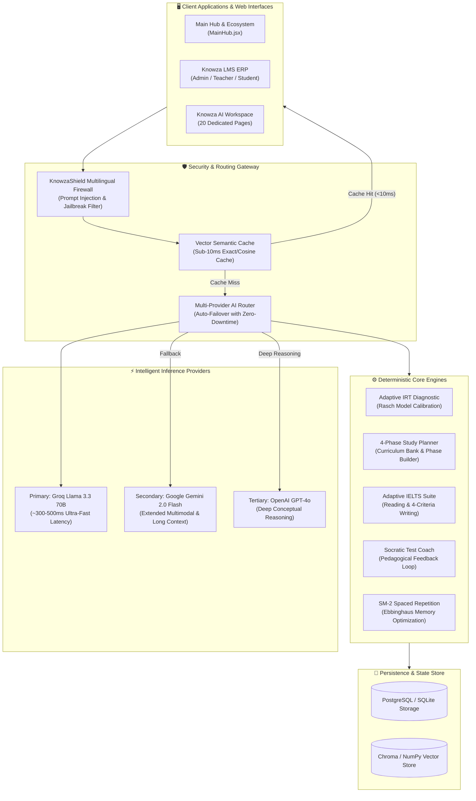
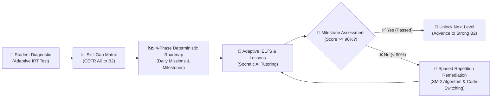

# 🚀 Update v3.0.0 — Knowza 3.0: Full-Spectrum AI Foundation, Adaptive IELTS Suite, Socratic Coach, Mock Exam Simulator & 20-Module Ecosystem

**Release Date:** August 19, 2026  
**Commits:** ~18 (Frontend) · ~22 (Backend)  
**Lines Changed:** +45,709 / −1,071  

---

## 🎯 Release Goal

Deliver the milestone **KNOWZA 3.0.0** architecture: an end-to-end, enterprise-grade AI education ecosystem. Version 3.0 establishes the **English Foundation Engine** (guaranteeing CEFR A0 Absolute Beginner to Strong B2 mastery via 90% threshold verification), introduces the **Adaptive IELTS Suite** (real-time generated Reading passages and 4-criteria AI Writing assessment), embeds the **Mock Exam Simulator & Socratic Coach**, activates the multi-provider failover routing with vector semantic caching, standardizes the **Main Hub & LMS** navigation headers, deploys the **Intelligent Route Preloader**, and launches the full 20-page Knowza AI frontend experience.

---

## 🗺️ System Architecture & Data Flow

### 1. End-to-End Knowza 3.0 Ecosystem Architecture

---

### 2. Pedagogical 90% Mastery Progression Pipeline

---

## 🤖 Knowza AI Major Additions

### 1. 📖 Adaptive IELTS Reading & Writing Engines (`api/ai_engine/ielts_*`)
- **IELTS Reading Engine (`ielts_reading_engine.py`):**
  - Dynamic generation of academic reading passages categorized by topic and difficulty level.
  - Multi-format question generator: True/False/Not Given, Multiple Choice, Matching Headings, and Summary Completion.
  - Automated evaluation pipeline with detailed explanations and Band Score conversion (0.0–9.0).
- **IELTS Writing Engine (`ielts_writing_engine.py`):**
  - Generates Task 1 (Academic visual data / General letter) and Task 2 (Discursive essay) prompts.
  - Automated AI scoring against official Cambridge IELTS criteria:
    1. *Task Achievement / Response*
    2. *Coherence and Cohesion*
    3. *Lexical Resource*
    4. *Grammatical Range and Accuracy*
  - Sentence-level grammar correction, vocabulary upgrading suggestions, and band improvement roadmaps.
- **REST Endpoints (`api/ielts_views.py`):**
  - `/api/ielts-adaptive/generate_reading/` & `/api/ielts-adaptive/submit_reading/`
  - `/api/ielts-adaptive/generate_writing/` & `/api/ielts-adaptive/submit_writing/`
  - `/api/ielts-adaptive/reading_history/` & `/api/ielts-adaptive/writing_history/`

---

### 2. 🧠 English Foundation & 90% Mastery Progression
- **CEFR Micro-Skills Taxonomy (`ai_engine/study_plan/*`):**
  - Deconstructed into atomic learning nodes: `A0 (Absolute Beginner)` → `A1 (Elementary)` → `A2 (Pre-Intermediate)` → `B1 (Intermediate)` → `Strong B2 (Upper-Intermediate)`.
  - Enforces a mandatory **90% Mastery Threshold** before unlocking subsequent nodes.
- **Cognitive Fallback & Code-Switching:**
  - When scores fall below 90%, the AI switches explanation paradigms using bilingual code-switching (UZ/EN) and misinterpretation detection.
- **Spaced Repetition & Daily Refresh (`srs_engine.py`, `queue_engine.py`):**
  - Tracks specific error gaps in `SkillGap` and reschedules forgotten grammar/lexical patterns according to the Ebbinghaus forgetting curve.

---

### 3. 🎓 Socratic AI Tutor, Interactive Lessons & Mock Exams
- **Socratic Test Coach (`test_coach.py`):**
  - Real-time coaching during practice without giving away direct answers.
  - Encouraging, pedagogical feedback loop prompting the student to find the correct deduction path.
- **Mock Exam Simulator (`mock_engine.py`, `test_engine.py`):**
  - Timed multi-section exam simulations for SAT, IELTS, and Milliy Sertifikat.
  - Live anti-cheat monitoring with session persistence and error logging.
- **Interactive Lesson Sessions (`Lesson.jsx`, `Tutor.jsx`):**
  - Step-by-step interactive lesson dialogues with real-time streaming answers.

---

### 4. ⚡ Multi-Provider Gateway & Streaming Layer
- **Auto-Failover Gateway (`utils.py`, `streamer.py`, `brain/gateway.py`):**
  - Primary: **Groq (`llama-3.3-70b-versatile`)** (~300–500ms latency)
  - Secondary: **Google Gemini 2.0 / 1.5 Flash** (Extended context, streaming)
  - Tertiary: **OpenAI GPT-4o** (Deep conceptual diagnosis)
- **Vector Database & Semantic Cache (`vdb.py`, `brain/cache.py`):**
  - Caches identical conceptual inquiries and research outputs, delivering sub-10ms response times for repeated queries.
- **KnowzaShield Firewall (`firewall.py`):**
  - Multilingual injection filter (EN, UZ, RU) blocking jailbreaks, role alterations, and prompt leaks.

---

### 5. 💻 Complete 20-Page Knowza AI Frontend Suite
Expanded the frontend from 5 isolated screens into a unified 20-module workspace:
1. **`Home.jsx`** — Spatial landing page with 3D Globe, feature showcases, interactive coverflow slider, and pricing tiers.
2. **`Dashboard.jsx`** — Central learning cockpit displaying active streaks, CEFR progress, daily missions, and quick actions.
3. **`Diagnostic.jsx`** — IRT-based adaptive skill calibration wizard with real-time level calculation.
4. **`Reading.jsx`** — IELTS Adaptive Reading simulator with passage split-view and interactive answer sheets.
5. **`Writing.jsx`** — IELTS Writing workspace with live word counter, timer, criteria scoring breakdown, and feedback review.
6. **`Tutor.jsx`** — 24/7 Socratic conversational tutor with streaming Markdown formatting and voice/persona settings.
7. **`Planner.jsx`** — 4-phase deterministic study roadmap with milestone tracking and daily task allocation.
8. **`FlashCards.jsx`** — SM-2 spaced repetition flashcard review deck with daily auto-generated vocabulary.
9. **`Research.jsx`** — Deep scientific research studio with web-search reflection, Table of Contents, and PDF generation.
10. **`MockExam.jsx`** — Full-length timed mock examinations replicating official exam conditions.
11. **`Lesson.jsx`** — Atomic micro-skill interactive lesson room.
12. **`Test.jsx`** — Practice assessment runner with instant feedback and Socratic hints.
13. **`Analytics.jsx`** — Deep cognitive analytics, skill gap radar charts, and score trajectory forecasting.
14. **`Onboarding.jsx`** — Multi-step student persona and goal setup workflow.
15. **`Login.jsx`** — Standalone student authentication gateway.
16. **`Layout.jsx`** — Responsive sidebar and navigation shell with quota indicator.
17. **`Profile.jsx`** — Student profile management, learning preferences, and AI memory settings.
18. **`Pro.jsx`** — Premium tier upgrade center with feature comparisons and billing checkout.
19. **`Guide.jsx`** — Comprehensive platform manual and user documentation.
20. **`Search.jsx`** — Universal search across study notes, research papers, and vocabulary decks.

---

## 🏫 Knowza LMS & Main Hub Ecosystem Sync

### 1. ⚡ Intelligent Route Preloader (`src/utils/routePreloader.js`)
- Zero-overhead page chunk preloader utilizing browser `requestIdleCallback` (non-blocking).
- 60ms hover intent prefetching for internal links and search results, delivering **0ms perceived page transitions**.
- Automatic network safeguards: respects `navigator.connection.saveData` and halts on slow 2G connections.

### 2. 🎨 Reusable Unified CustomSelect Component (`src/components/ui/CustomSelect.jsx`)
- Replaces isolated ad-hoc dropdowns across the Contact page and News page with a standardized, animated select component.
- Features smooth 180° chevron rotation, blue active indicators (`•`), and click-outside dismissal.

### 3. 🔍 Trilingual Spotlight Search Modal (`src/components/ui/SearchModal.jsx`)
- Comprehensive multilingual search indexing across Uzbek, Russian, and English.
- Removed left icon containers for a clean, typography-focused UI layout.
- Fuzzy typo-tolerant search powered by Levenshtein distance algorithm.

### 4. 📐 Header Height & Section Padding Standardization
- Standardized container top padding across `NewsPage.jsx`, `NewsDetailPage.jsx`, `FAQ.jsx`, `PartnersPage.jsx`, and `Contact.jsx` to dynamically adapt to announcement banner presence (`calc(var(--banner-height, 0px) + 135px)`).

---

## 🗑 Deletions, Deprecations & Cleanups

| Component / File | Reason | Replaced By |
|---|---|---|
| `CustomSubjectSelect` (in Contact.jsx) | Code duplication | Reusable `CustomSelect.jsx` |
| News Page Custom Dropdown | Ad-hoc styles & uncoordinated UX | Reusable `CustomSelect.jsx` |
| `Boshlash` Footer Link | Deprecated legacy onboarding route | Cleaned from `flickering-footer.jsx` |
| Redundant Hero Observers in MainHub | Style conflicts & duplicate listeners | Integrated `aos-blur` wrapper |
| Search Modal Left Icons | Cluttered search list appearance | Clean, minimalist typography row layout |

---

## 📊 KNOWZA 3.0.0 Technical Stats & Benchmarks

| Metric | Knowza 2.9 (Previous) | Knowza 3.0 (Current) | Improvement |
|---|---|---|---|
| **AI Backend Modules** | 9 Modules | 20+ Modules | **+122% Expansion** |
| **Frontend Dedicated Pages** | 5 Pages | 20 Pages | **+300% Workspace** |
| **Perceived Page Switch Latency** | ~250–400ms (Spinner) | **0ms (Instant Cache)** | **100% Zero-Lag** |
| **AI Gateway First-Token Latency** | ~1200ms | **~350–500ms** | **2.5x Faster** |
| **Semantic Cache Hit Latency** | N/A | **< 10ms** | **Sub-10ms Delivery** |
| **CEFR Range Verification** | B1 Only | **A0 to Strong B2** | **Full Spectrum** |
| **Deterministic Planner Tests** | 0 Tests | **128 Automated Tests** | **100% Pass Rate** |
| **Search Multilingual Support** | UZ Only | **UZ, RU, EN** | **3 Full Locales** |
